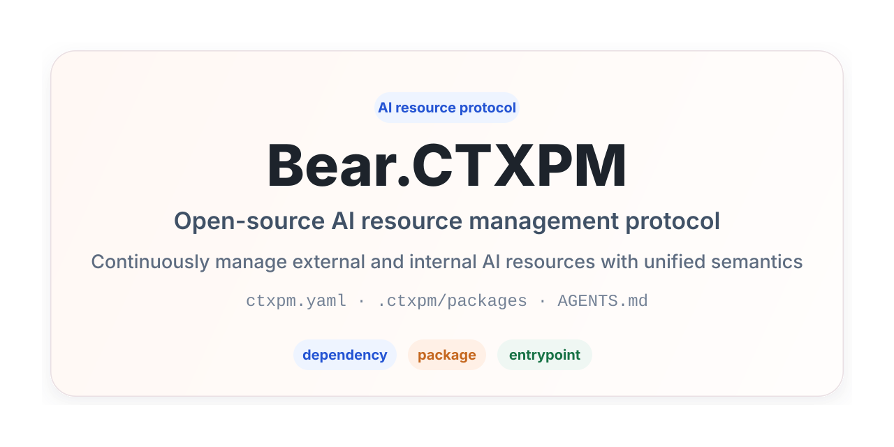

# Bear.CTXPM Project Introduction



[`en` English](README.md) | [`ja` 日本語](docs/README.ja.md) | [`ko` 한국어](docs/README.ko.md) | [`zh-CN` 简体中文](docs/README.zh-CN.md)

Bear.CTXPM is a fully open-source protocol for managing AI resources. It uses unified `dependency` / `package` semantics to manage both external and internal AI resources in a project. Through documentation conventions, directory structure, and agent root entrypoint document bridging, AI agents can directly understand, discover, and use these resources inside a project.

## Background

As AI coding agents, project-level skills, rules, specifications, prompts, memories, and MCP tools become part of everyday engineering workflows, projects continuously accumulate two kinds of AI resources:

- External shared resources: resources from team-wide repositories, third-party repositories, or private registries that should be referenced and reused like dependencies, but whose original content should not be committed into the project.
- Project-local resources: resources tightly coupled to the current business domain, collaboration model, and code structure. They should be versioned like source code, participate in review, and evolve with the project.

Bear.CTXPM aims to provide a unified convention that AI can directly understand and execute, so a project can continuously manage AI resources without depending on a specific CLI or agent.

## One-line Installation Instruction for AI Agents

```text
Please follow the instructions in https://raw.githubusercontent.com/gBearBest/Bear.CTXPM/latest/INSTALL.md to inspect, install, initialize, and refactor this project into a Bear.CTXPM-compliant structure for managing AI dependencies and resources.
```

## Core Goals

Bear.CTXPM v0.1 is first a protocol, not a tool that must be installed. It focuses on:

- Managing AI resources with a unified `dependency` / `package` model.
- Integrating common `skill`, `rule`, `spec`, `prompt`, `memory`, and `mcp` directories without transforming their original formats.
- Describing resource declarations and entrypoint configuration through `ctxpm.yaml`.
- Organizing project-local and external resources through `.ctxpm/packages/` and `.ctxpm/dependencies/`.
- Connecting resources to different agents through root Markdown entrypoint documents.
- Allowing AI to perform basic resource management according to the protocol even without dedicated tooling.

## Core Concepts

### dependency

A `dependency` represents an external AI resource that the project depends on. It may come from an OCI registry, Git repository, local file path, or other future source types. Its content is not committed by default, but its logical declaration remains in `ctxpm.yaml`.

### package

A `package` represents an AI resource maintained inside the project. Its content lives in the project workspace and should be committed to version control and reviewed.

### resource type

A resource type describes the shape of the content. Standard resource types in Bear.CTXPM v0.1 include:

- `skill`
- `rule`
- `spec`
- `prompt`
- `memory`
- `mcp`

`dependency` / `package` determines the source and lifecycle of a resource, while `resource type` determines its content shape and consumption method.

### entrypoint

An `entrypoint` is a root Markdown entry surface that agents read before scanning `.ctxpm/...`. The managed content lives at `.ctxpm/AGENTS.md`, while all root-level agent entrypoint files (`AGENTS.md`, `CLAUDE.md`, `ANTIGRAVITY.md`, etc.) are symlinks that point directly to `.ctxpm/AGENTS.md`. Bear.CTXPM uses the managed `ctxpm` block in `.ctxpm/AGENTS.md` to provide one shared set of resource-reading instructions, and uses `ctxpm.yaml` to declare which agent profiles are enabled and which compatibility root filenames should resolve to that canonical source file.

## Recommended Directory Structure

Bear.CTXPM v0.1 recommends the following minimal project structure:

```text
project/
  ctxpm.yaml
  .ctxpm/
    AGENTS.md
    dependencies/
      skills/
      rules/
      specs/
      prompts/
      memories/
      mcp/
    packages/
      skills/
      rules/
      specs/
      prompts/
      memories/
      mcp/
  AGENTS.md -> .ctxpm/AGENTS.md
  CLAUDE.md -> .ctxpm/AGENTS.md
  ANTIGRAVITY.md -> .ctxpm/AGENTS.md
```

Where:

- `ctxpm.yaml`: a project manifest maintained jointly by users and AI.
- `.ctxpm/dependencies/`: the workspace for external resources, which should be ignored by default in `.gitignore`.
- `.ctxpm/packages/`: the directory for project-local resources, which should be committed to version control by default.
- `.ctxpm/AGENTS.md`: the canonical managed entrypoint file where content is stored.
- Root entrypoint filenames (`AGENTS.md`, `CLAUDE.md`, etc.): symlinks pointing directly to `.ctxpm/AGENTS.md`; generated by `ctxpm entrypoint sync` and kept out of version control via `.gitignore`.

## Design Principles

- Protocol first: Bear.CTXPM is first a documented protocol, not a command set.
- Unified semantics: expose only two package semantics to users, `dependency` and `package`.
- Tool agnostic: the core model is not bound to any specific agent or implementation.
- Format compatibility first: prioritize compatibility with existing native organization patterns for skills, rules, specs, prompts, memories, MCP configuration, and similar resources.
- AI as the primary executor: AI should be able to identify, organize, and explain resources based on the project protocol.
- Entry consistency: different agents should obtain consistent resource usage guidance through root entrypoint documents.
- Internal and external separation: external resources and project-local resources have clearly separated storage locations, version control policies, and lifecycles.
- Fully open source: the project evolves in a mature open-source way and reuses existing open-source infrastructure where possible.

## Standard AI Workflow

When an AI takes over a Bear.CTXPM project, it is recommended to follow this workflow:

1. Read `AGENTS.md` (or any root entrypoint symlink) and `ctxpm.yaml`, then follow any agent profile mappings declared in `ctxpm.yaml`.
2. Scan `.ctxpm/packages/` first, then `.ctxpm/dependencies/`.
3. Identify resources by combining explicit declarations in `ctxpm.yaml` with the directory structure.
4. Decide which resources to read based on the task context, including loading `memory` resources on demand when a task depends on project history or prior decisions.
5. Maintain the managed `ctxpm` block in `.ctxpm/AGENTS.md` and keep any agent-specific root entrypoint symlinks pointing to it.
6. When an operation cannot be completed safely, report the issue and provide organization suggestions.

## Non-goals in v0.1

Bear.CTXPM v0.1 does not require:

- A self-hosted online registry.
- Agent-specific intermediate export directories.
- A core workflow that strongly depends on network-connected AI.
- A lockfile mechanism.
- Dedicated metadata files for every resource package.
- Installing or running a dedicated CLI.

## Use Cases

Bear.CTXPM is suitable for projects that want to maintain AI resources over the long term, especially when:

- Teams want to reuse shared AI rules, specifications, prompts, memories, or skills.
- A project already has AI resources that need to evolve together with the code.
- Multiple AI agents need to read consistent resource entrypoints in the same project.
- Teams want to establish AI resource management conventions without binding themselves to a specific toolchain.

## Related Documents

- [Installation instructions v0.1](INSTALL.md)
