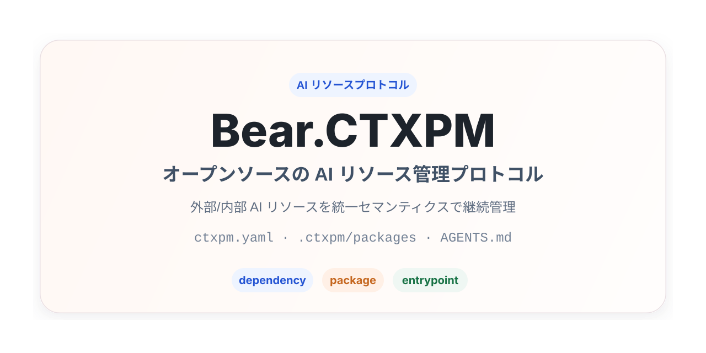

# Bear.CTXPM プロジェクト紹介



[`en` English](README.en.md) | [`ja` 日本語](README.ja.md) | [`ko` 한국어](README.ko.md) | [`zh-CN` 简体中文](README.zh-CN.md)

Bear.CTXPM は、AI リソースを管理するための完全なオープンソースプロトコルです。統一された `dependency` / `package` セマンティクスを使って、プロジェクト内の外部および内部 AI リソースを管理します。また、ドキュメント規約、ディレクトリ構造、agent のルートエントリーポイント文書をつなぐ仕組みにより、AI がプロジェクト内でこれらのリソースを直接理解、発見、利用できるようにします。

## 背景

AI coding agent、プロジェクトレベルの skill、rule、spec、prompt、MCP ツールが日常的なエンジニアリングワークフローに入ってくるにつれて、プロジェクトには次の 2 種類の AI リソースが継続的に蓄積されます。

- 外部共有リソース: チーム共通リポジトリ、サードパーティリポジトリ、またはプライベート registry から取得されるリソースです。依存関係のように参照、再利用したい一方で、元の内容をプロジェクトのバージョン管理へコミットしたくないものです。
- プロジェクト内リソース: 現在の業務、チームの協業方法、コード構造と強く結び付いたリソースです。ソースコードと同じようにバージョン管理され、レビューされ、プロジェクトとともに進化する必要があります。

Bear.CTXPM の目的は、AI が直接理解して実行できる統一された規約を提供することです。これにより、プロジェクトは特定の CLI や特定の agent に依存せず、AI リソースを継続的に管理できます。

## AI 向け 1 文インストール指示

```text
https://raw.githubusercontent.com/gBearBest/Bear.CTXPM/main/INSTALL.md の説明に従って、このプロジェクトを検査、インストール、初期化、改造し、AI 依存関係と AI リソースを管理する Bear.CTXPM 準拠の構造にしてください。
```

## コア目標

Bear.CTXPM v0.1 は、まずプロトコルであり、必ずインストールしなければならないツールではありません。主に次の点に焦点を当てます。

- 統一された `dependency` / `package` モデルで AI リソースを管理する。
- 既存の形式を変換せずに、一般的な `skill`、`rule`、`spec`、`prompt`、`mcp` ディレクトリを取り込む。
- `ctxpm.yaml` によって、プロジェクト内のリソース宣言とエントリーポイント設定を記述する。
- `.ctxpm/packages/` と `.ctxpm/dependencies/` によって、プロジェクト内リソースと外部リソースを整理する。
- ルート Markdown エントリーポイント文書を通じて、リソースを異なる agent に接続する。
- 専用ツールがない場合でも、AI がプロトコルに従って基本的なリソース管理を行えるようにする。

## コア概念

### dependency

`dependency` は、プロジェクトが依存する外部 AI リソースを表します。OCI registry、Git repository、ローカルファイルパス、または将来的に拡張されるその他のソースから取得できます。その内容はデフォルトではバージョン管理に含めませんが、論理的な宣言は `ctxpm.yaml` に保持されます。

### package

`package` は、プロジェクト内で保守される AI リソースを表します。その内容はプロジェクトワークスペース内にあり、バージョン管理に含めてレビューされるべきです。

### resource type

resource type は、コンテンツの形態を表します。Bear.CTXPM v0.1 の標準リソースタイプは次のとおりです。

- `skill`
- `rule`
- `spec`
- `prompt`
- `mcp`

`dependency` / `package` はリソースの由来とライフサイクルを決定し、`resource type` はコンテンツの形態と利用方法を決定します。

### entrypoint

`entrypoint` は、agent が読むためにプロジェクトルートに置かれる Markdown エントリーファイルです。例として `AGENTS.md` や `CLAUDE.md` があります。Bear.CTXPM は、エントリーポイント文書内の `ctxpm` 管理ブロックを通じて、異なる agent に一貫したリソース読み取り手順を提供します。管理ブロックは `INSTALL.md` で定義された canonical template を使用し、ファイルごとに変えてよいのは対応する agent 識別子だけです。デフォルトでは、管理対象リソースは対応する resource type について、宣言済みの各 agent が認識できる discovery directory に compatibility symlink としても公開し、canonical な内容は `.ctxpm/...` 配下に維持します。

## 推奨ディレクトリ構造

Bear.CTXPM v0.1 では、次の最小構成を推奨します。

```text
project/
  ctxpm.yaml
  .ctxpm/
    dependencies/
      skills/
      rules/
      specs/
      prompts/
      mcp/
    packages/
      skills/
      rules/
      specs/
      prompts/
      mcp/
  AGENTS.md / CLAUDE.md / その他の agent ルートエントリーポイント文書
```

各要素の意味は次のとおりです。

- `ctxpm.yaml`: ユーザーと AI が共同で保守するプロジェクトマニフェスト。
- `.ctxpm/dependencies/`: 外部リソースのワークスペース。デフォルトでは `.gitignore` に追加するべきです。
- `.ctxpm/packages/`: プロジェクト内リソースのディレクトリ。デフォルトではバージョン管理に含めるべきです。
- ルート Markdown エントリーポイント文書: AI がプロジェクトに入った後の最初の入口。

## 設計原則

- プロトコル優先: Bear.CTXPM はまず文書化されたプロトコルであり、コマンド群ではありません。
- セマンティクスの統一: ユーザーには `dependency` と `package` の 2 種類のパッケージセマンティクスだけを公開します。
- ツール非依存: コアモデルは特定の agent や実装方式に依存しません。
- 形式互換性優先: 既存の skill、rule、spec、prompt、MCP 設定などのネイティブな整理方式との互換性を優先します。
- AI が主な実行者: AI はプロジェクトプロトコルに基づいて、リソースを識別、整理、説明できるべきです。
- エントリーポイントの一貫性: 異なる agent がルートエントリーポイント文書を通じて、一貫したリソース利用ガイドを取得できるべきです。
- 内外分離: 外部リソースとプロジェクト内リソースは、保存場所、バージョン管理方針、ライフサイクルを明確に分離します。
- 完全なオープンソース: プロジェクトは成熟したオープンソースの方法で進化し、既存のオープンソース基盤を可能な限り再利用します。

## AI の標準ワークフロー

AI が Bear.CTXPM プロジェクトを引き継ぐときは、次の流れに従うことを推奨します。

1. ルート Markdown エントリーポイント文書と `ctxpm.yaml` を読む。
2. まず `.ctxpm/packages/` をスキャンし、その後 `.ctxpm/dependencies/` をスキャンする。
3. `ctxpm.yaml` の明示的な宣言とディレクトリ構造を組み合わせてリソースを識別する。
4. タスクのコンテキストに応じて、読む必要があるリソースを判断する。
5. エントリーポイント文書内の `ctxpm` 管理ブロックを保守し、リソース位置、読み取り優先順位、競合処理ルールを明確かつ安定させる。
6. 安全に操作を完了できない場合は、問題を報告し、整理案を提示する。

## v0.1 の非目標

Bear.CTXPM v0.1 では、次のものは必須ではありません。

- 独自のオンライン registry。
- agent 専用の中間エクスポートディレクトリ。
- ネットワーク接続された AI に強く依存するコアワークフロー。
- lockfile 方式。
- 各リソースパッケージ専用のメタデータファイル。
- 専用 CLI のインストールまたは実行。

## 利用シーン

Bear.CTXPM は、AI リソースを長期的に保守したいプロジェクトに適しています。特に次のような場合に有用です。

- チームが共通の AI rule、spec、prompt、skill を再利用したい。
- プロジェクト内に、コードとともに進化させる必要がある AI リソースがすでに存在する。
- 複数の AI agent が、同じプロジェクト内で一貫したリソース入口を読む必要がある。
- 特定のツールチェーンに依存せずに、AI リソース管理の規約を確立したい。

## 関連ドキュメント

- [インストール手順 v0.1](../INSTALL.md)
