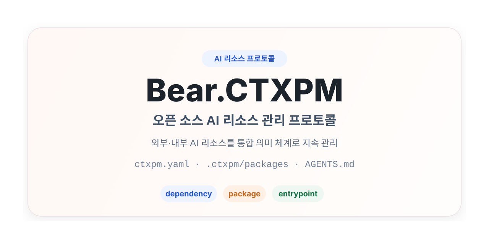

# Bear.CTXPM 프로젝트 소개



[`en` English](README.en.md) | [`ja` 日本語](README.ja.md) | [`ko` 한국어](README.ko.md) | [`zh-CN` 简体中文](README.zh-CN.md)

Bear.CTXPM은 AI 리소스를 관리하기 위한 완전한 오픈 소스 프로토콜입니다. 통합된 `dependency` / `package` 의미 체계를 사용하여 프로젝트의 외부 및 내부 AI 리소스를 관리합니다. 또한 문서 규약, 디렉터리 구조, agent 루트 엔트리포인트 문서 연결 방식을 통해 AI가 프로젝트 안에서 이러한 리소스를 직접 이해하고, 발견하고, 사용할 수 있게 합니다.

## 배경

AI coding agent, 프로젝트 수준의 skill, rule, spec, prompt, memory, MCP 도구가 일상적인 엔지니어링 워크플로에 점차 들어오면서, 프로젝트에는 두 종류의 AI 리소스가 계속 축적됩니다.

- 외부 공유 리소스: 팀 공용 저장소, 서드파티 저장소, 또는 private registry에서 가져오는 리소스입니다. 의존성처럼 참조하고 재사용하고 싶지만, 원본 내용을 프로젝트 버전 관리에 커밋하고 싶지는 않은 리소스입니다.
- 프로젝트 내부 리소스: 현재 비즈니스, 팀 협업 방식, 코드 구조와 강하게 연결된 리소스입니다. 소스 코드처럼 버전 관리에 포함되고, 리뷰를 거치며, 프로젝트와 함께 발전해야 합니다.

Bear.CTXPM의 목표는 AI가 직접 이해하고 실행할 수 있는 통합 규약을 제공하는 것입니다. 이를 통해 프로젝트는 특정 CLI나 특정 agent에 의존하지 않고도 AI 리소스를 지속적으로 관리할 수 있습니다.

## AI를 위한 한 문장 설치 지침

```text
https://raw.githubusercontent.com/gBearBest/Bear.CTXPM/latest/INSTALL.md 문서의 설명에 따라 이 프로젝트를 검사, 설치, 초기화, 개조하여 AI 의존성과 AI 리소스를 관리하는 Bear.CTXPM 준수 구조로 만들어 주세요.
```

## 핵심 목표

Bear.CTXPM v0.1은 먼저 프로토콜이며, 반드시 설치해야 하는 도구가 아닙니다. 다음 사항에 집중합니다.

- 통합된 `dependency` / `package` 모델로 AI 리소스를 관리합니다.
- 기존 리소스 형식을 바꾸지 않고 일반적인 `skill`, `rule`, `spec`, `prompt`, `memory`, `mcp` 디렉터리를 연결합니다.
- `ctxpm.yaml`을 통해 프로젝트의 리소스 선언과 엔트리포인트 설정을 설명합니다.
- `.ctxpm/packages/`와 `.ctxpm/dependencies/`를 통해 프로젝트 내부 리소스와 외부 리소스를 구성합니다.
- 루트 Markdown 엔트리포인트 문서를 통해 리소스를 여러 agent에 연결합니다.
- 전용 도구가 없어도 AI가 프로토콜에 따라 기본적인 리소스 관리를 수행할 수 있게 합니다.

## 핵심 개념

### dependency

`dependency`는 프로젝트가 의존하는 외부 AI 리소스를 의미합니다. OCI registry, Git repository, 로컬 파일 경로, 또는 향후 확장될 다른 소스에서 올 수 있습니다. 해당 내용은 기본적으로 버전 관리에 포함하지 않지만, 논리적 선언은 `ctxpm.yaml`에 유지됩니다.

### package

`package`는 프로젝트 내부에서 유지 관리되는 AI 리소스를 의미합니다. 그 내용은 프로젝트 워크스페이스 안에 있으며, 버전 관리에 포함되고 리뷰를 거쳐야 합니다.

### resource type

resource type은 콘텐츠의 형태를 설명합니다. Bear.CTXPM v0.1의 표준 리소스 타입은 다음과 같습니다.

- `skill`
- `rule`
- `spec`
- `prompt`
- `memory`
- `mcp`

`dependency` / `package`는 리소스의 출처와 생명주기를 결정하고, `resource type`은 콘텐츠 형태와 소비 방식을 결정합니다.

### entrypoint

`entrypoint`는 agent가 `.ctxpm/...`를 읽기 전에 먼저 확인하는 루트 Markdown 엔트리 표면입니다. 공유 엔트리포인트 모델에서는 `AGENTS.md`가 유일한 canonical managed file이며, `CLAUDE.md`, `ANTIGRAVITY.md` 같은 agent별 루트 파일명은 `AGENTS.md`를 가리키는 compatibility symlink로 취급합니다. Bear.CTXPM은 `AGENTS.md` 안의 `ctxpm` 관리 블록으로 공통 리소스 읽기 지침을 제공하고, `ctxpm.yaml`로 어떤 agent profile이 활성화되어 있는지와 어떤 루트 파일명이 이 canonical 파일로 해석되어야 하는지를 선언합니다.

## 권장 디렉터리 구조

Bear.CTXPM v0.1은 다음과 같은 최소 구조를 권장합니다.

```text
project/
  ctxpm.yaml
  .ctxpm/
    dependencies/
      skills/
      rules/
      specs/
      prompts/
      memories/
      mcp/
    packages/
      skills/
      rules/
      specs/
      prompts/
      memories/
      mcp/
  AGENTS.md
  CLAUDE.md -> AGENTS.md
  ANTIGRAVITY.md -> AGENTS.md
```

각 항목의 의미는 다음과 같습니다.

- `ctxpm.yaml`: 사용자와 AI가 함께 유지 관리하는 프로젝트 manifest입니다.
- `.ctxpm/dependencies/`: 외부 리소스 워크스페이스이며, 기본적으로 `.gitignore`에 추가해야 합니다.
- `.ctxpm/packages/`: 프로젝트 내부 리소스 디렉터리이며, 기본적으로 버전 관리에 포함해야 합니다.
- `AGENTS.md`: canonical shared 루트 엔트리포인트 파일입니다.
- 기타 루트 엔트리포인트 파일명: 선언된 agent가 특정 파일명을 기대할 때 `AGENTS.md`로 되돌아가는 compatibility symlink입니다.

## 설계 원칙

- 프로토콜 우선: Bear.CTXPM은 먼저 문서화된 프로토콜이며, 명령어 모음이 아닙니다.
- 통합 의미 체계: 사용자에게는 `dependency`와 `package` 두 가지 패키지 의미 체계만 노출합니다.
- 도구 독립성: 핵심 모델은 특정 agent나 특정 구현 방식에 묶이지 않습니다.
- 형식 호환성 우선: 기존 skill, rule, spec, prompt, memory, MCP 설정 등의 원래 구성 방식을 우선적으로 호환합니다.
- AI가 주요 실행자: AI는 프로젝트 프로토콜에 따라 리소스를 식별하고, 정리하고, 설명할 수 있어야 합니다.
- 엔트리포인트 일관성: 서로 다른 agent가 루트 엔트리포인트 문서를 통해 일관된 리소스 사용 지침을 얻을 수 있어야 합니다.
- 내부와 외부 분리: 외부 리소스와 프로젝트 내부 리소스는 저장 위치, 버전 관리 정책, 생명주기에서 명확히 분리됩니다.
- 완전한 오픈 소스: 프로젝트는 성숙한 오픈 소스 방식으로 발전하며, 가능한 한 기존 오픈 소스 인프라를 재사용합니다.

## AI 표준 워크플로

AI가 Bear.CTXPM 프로젝트를 맡을 때는 다음 흐름을 따르는 것이 좋습니다.

1. 먼저 `AGENTS.md`와 `ctxpm.yaml`을 읽고, 이어서 `ctxpm.yaml`에 선언된 agent profile 매핑을 따릅니다.
2. 먼저 `.ctxpm/packages/`를 스캔한 뒤, `.ctxpm/dependencies/`를 스캔합니다.
3. `ctxpm.yaml`의 명시적 선언과 디렉터리 구조를 함께 사용해 리소스를 식별합니다.
4. 작업 컨텍스트에 따라 어떤 리소스를 읽어야 하는지 판단합니다. 프로젝트 이력이나 기존 의사결정에 의존하는 작업에서는 `memory` 리소스도 필요에 따라 읽습니다.
5. `AGENTS.md` 안의 `ctxpm` 관리 블록을 유지하고, agent별 루트 엔트리포인트 alias가 그 canonical 파일과 계속 동기화되도록 합니다.
6. 안전하게 작업을 완료할 수 없을 때는 문제를 보고하고 정리 제안을 제공합니다.

## v0.1의 비목표

Bear.CTXPM v0.1은 다음을 요구하지 않습니다.

- 자체 온라인 registry 구축.
- agent 전용 중간 export 디렉터리.
- 네트워크 연결 AI에 강하게 의존하는 핵심 워크플로.
- lockfile 메커니즘.
- 각 리소스 패키지를 위한 전용 메타데이터 파일.
- 전용 CLI 설치 또는 실행.

## 적용 시나리오

Bear.CTXPM은 AI 리소스를 장기적으로 유지 관리하려는 프로젝트에 적합합니다. 특히 다음과 같은 경우에 유용합니다.

- 팀이 공용 AI rule, spec, prompt, memory, skill을 재사용하려는 경우.
- 프로젝트 안에 코드와 함께 발전해야 하는 AI 리소스가 이미 있는 경우.
- 여러 AI agent가 같은 프로젝트 안에서 일관된 리소스 엔트리포인트를 읽어야 하는 경우.
- 특정 도구 체인에 묶이지 않고 AI 리소스 관리 규약을 세우고 싶은 경우.

## 관련 문서

- [설치 지침 v0.1](../INSTALL.md)
