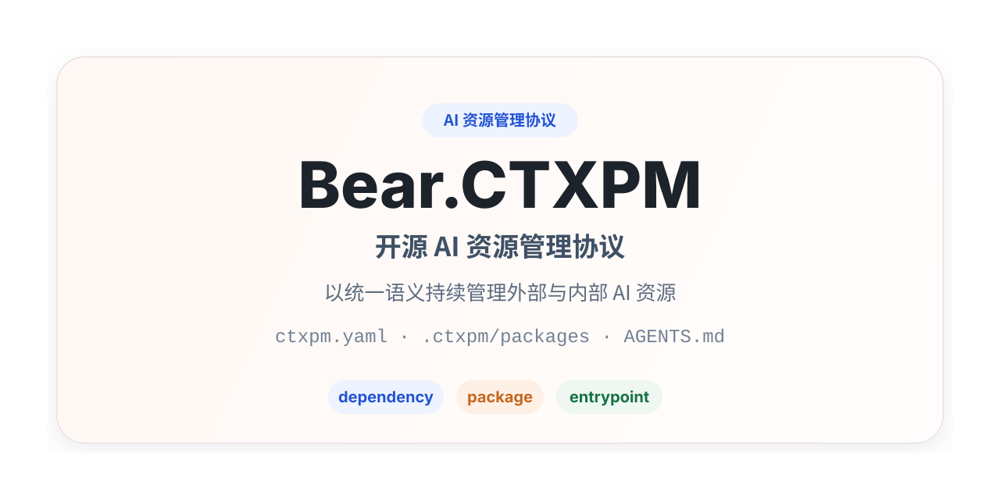

# Bear.CTXPM 项目介绍



[`en` English](README.en.md) | [`ja` 日本語](README.ja.md) | [`ko` 한국어](README.ko.md) | [`zh-CN` 简体中文](README.zh-CN.md)

Bear.CTXPM 是一个完全开源的 AI 资源管理协议。它用统一的 `dependency` / `package` 语义管理项目中的外部与内部 AI 资源，并通过文档约定、目录结构和 agent 根入口文档桥接机制，让 AI 可以直接在项目中理解、发现和使用这些资源。

## 背景

随着 AI coding agent、项目级 skill、规则、规范、prompt、记忆和 MCP 工具逐渐进入日常工程流程，项目中会持续积累两类 AI 资源：

- 外部共享资源：来自团队公共仓库、第三方仓库或私有 registry，希望像依赖一样被引用和复用，但不希望把原始内容提交到项目版本控制中。
- 项目内资源：与当前业务、团队协作方式、代码结构强相关，需要像源码一样进入版本控制、参与 review，并随项目一起演进。

Bear.CTXPM 的目标是提供一套 AI 可以直接理解和执行的统一约定，让项目不依赖特定 CLI 或特定 agent，也能持续管理这些 AI 资源。

## 给 AI 的一句话安装指令

```text
请按照 https://raw.githubusercontent.com/gBearBest/Bear.CTXPM/main/INSTALL.md 文档中的说明，对本项目进行检测、安装、初始化与改造，使其成为用于管理 AI 依赖与 AI 资源的 Bear.CTXPM 协议结构。
```

## 核心目标

Bear.CTXPM v0.1 首先是一套协议，而不是一个必须先安装的工具。它聚焦于：

- 用统一的 `dependency` / `package` 模型管理 AI 资源。
- 在不改造原始资源格式的前提下接入常见 `skill`、`rule`、`spec`、`prompt`、`memory`、`mcp` 目录。
- 通过 `ctxpm.yaml` 描述项目中的资源声明与入口配置。
- 通过 `.ctxpm/packages/` 与 `.ctxpm/dependencies/` 组织项目内资源和外部资源。
- 通过根入口 Markdown 文档把资源接入不同 agent。
- 让 AI 在没有专门工具的前提下，也能根据协议完成基础资源管理。

## 核心概念

### dependency

`dependency` 表示项目依赖的外部 AI 资源。它可以来自 OCI registry、Git repository、本地文件路径或未来扩展的其他来源。其内容默认不进入项目版本控制，但逻辑声明会保留在 `ctxpm.yaml` 中。

### package

`package` 表示项目内维护的 AI 资源。它的内容位于项目工作区中，应进入版本控制并参与 review。

### resource type

资源类型描述内容形态。Bear.CTXPM v0.1 的标准资源类型包括：

- `skill`
- `rule`
- `spec`
- `prompt`
- `memory`
- `mcp`

`dependency` / `package` 决定资源来源与生命周期，`resource type` 决定内容形态与消费方式。

### entrypoint

`entrypoint` 指项目根目录中供 agent 读取的 Markdown 入口文件，例如 `AGENTS.md`、`CLAUDE.md`。Bear.CTXPM 会通过入口文档中的 `ctxpm` 受管区块，为不同 agent 提供一致的资源读取说明。受管区块应使用 `INSTALL.md` 中定义的 canonical template，各文件之间只应变更入口文件对应的 agent 标识符。默认情况下，受管资源还应通过 compatibility symlink 暴露到每个已声明 agent 可识别的对应资源类型发现目录中，而 canonical 内容仍保留在 `.ctxpm/...` 下。

## 推荐目录结构

Bear.CTXPM v0.1 推荐项目采用以下最小结构：

```text
project/
  ctxpm.yaml
  .ctxpm/
    dependencies/
      skills/
      rules/
      specs/
      prompts/
      memories/
      mcp/
    packages/
      skills/
      rules/
      specs/
      prompts/
      memories/
      mcp/
  AGENTS.md / CLAUDE.md / 其他 agent 根入口文档
```

其中：

- `ctxpm.yaml`：由用户和 AI 共同维护的项目清单。
- `.ctxpm/dependencies/`：外部资源工作区，默认应加入 `.gitignore`。
- `.ctxpm/packages/`：项目内资源目录，默认应进入版本控制。
- 根入口 Markdown 文档：AI 进入项目后的第一入口。

## 设计原则

- 协议优先：Bear.CTXPM 首先是一套文档化协议，而不是命令集合。
- 语义统一：对用户只暴露 `dependency` 和 `package` 两种包语义。
- 工具无关：核心模型不绑定某个 agent 或某种实现方式。
- 格式兼容优先：优先兼容已有 skill、rule、spec、prompt、memory、MCP 配置等原生组织方式。
- AI 是主要执行者：AI 应能基于项目协议主动识别、整理和解释资源。
- 入口一致性：不同 agent 应能通过根入口文档获得一致的资源使用指引。
- 内外分离：外部资源与项目内资源在存储位置、版本控制策略和生命周期上明确区分。
- 完全开源：项目采用成熟开源方式演进，并尽量复用现有开源基础设施。

## AI 的标准工作流

当 AI 接管一个 Bear.CTXPM 项目时，建议遵循以下流程：

1. 读取根入口 Markdown 文档和 `ctxpm.yaml`。
2. 优先扫描 `.ctxpm/packages/`，再扫描 `.ctxpm/dependencies/`。
3. 结合 `ctxpm.yaml` 的显式声明和目录结构识别资源。
4. 根据任务上下文判断需要查阅哪些资源，包括在任务依赖项目历史或既有决策时按需加载 `memory` 资源。
5. 维护入口文档中的 `ctxpm` 受管区块，确保资源位置、读取优先级和冲突处理规则清晰稳定。
6. 在无法安全完成操作时，报告问题并给出整理建议。

## v0.1 非目标

Bear.CTXPM v0.1 不要求：

- 自建在线 registry。
- agent 专用中间导出目录。
- 强依赖联网 AI 才能工作的核心流程。
- lockfile 机制。
- 为每个资源包引入专属元数据文件。
- 安装或运行专门的 CLI。

## 适用场景

Bear.CTXPM 适合希望长期维护 AI 资源的项目，尤其适用于：

- 团队希望复用公共 AI 规则、规范、prompt、记忆或 skill。
- 项目内已经存在需要随代码一起演进的 AI 资源。
- 多个 AI agent 需要在同一个项目中读取一致的资源入口。
- 希望在不绑定特定工具链的前提下建立 AI 资源管理约定。

## 相关文档

- [安装指令 v0.1（英文）](../INSTALL.md)
